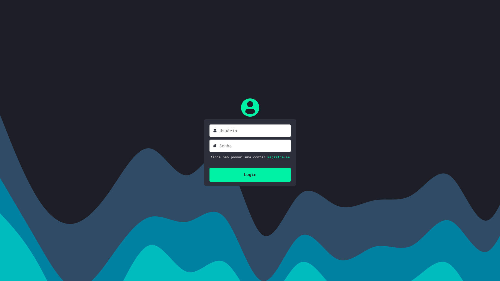

# 🤖 Projeto de homepage feito com React.

</img>

# 📌 To do

- Finalizar homepage ❌
- Criar verificação de login ❌
- Conectar à um banco de dados ❌

# 👾 Tecnologias usadas

- React js
- Html
- Css
- Js

## 💻 Tecnologias à serem implementadas

- Prisma Js
- Scss
- Php
